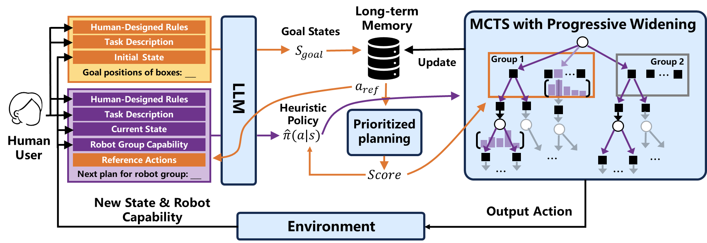

# LLM-PWMCTS: Toward Multi-Robot Task Planning via Large Language Models and Progressive Widening Monte Carlo Tree Search

<b>The code will soon be open source.</b> This is our implementation for the paper: <b>LLM-PWMCTS: Toward Multi-Robot Task Planning via Large Language Models and Progressive Widening Monte Carlo Tree Search</b>

    

## Recommended Work

[Scalable Multi-Robot Collaboration with Large Language Models: Centralized or Decentralized Systems?](https://arxiv.org/pdf/2309.15943.pdf)

[Large Language Models as Commonsense Knowledge for Large-Scale Task Planning](https://arxiv.org/pdf/2305.14078.pdf)